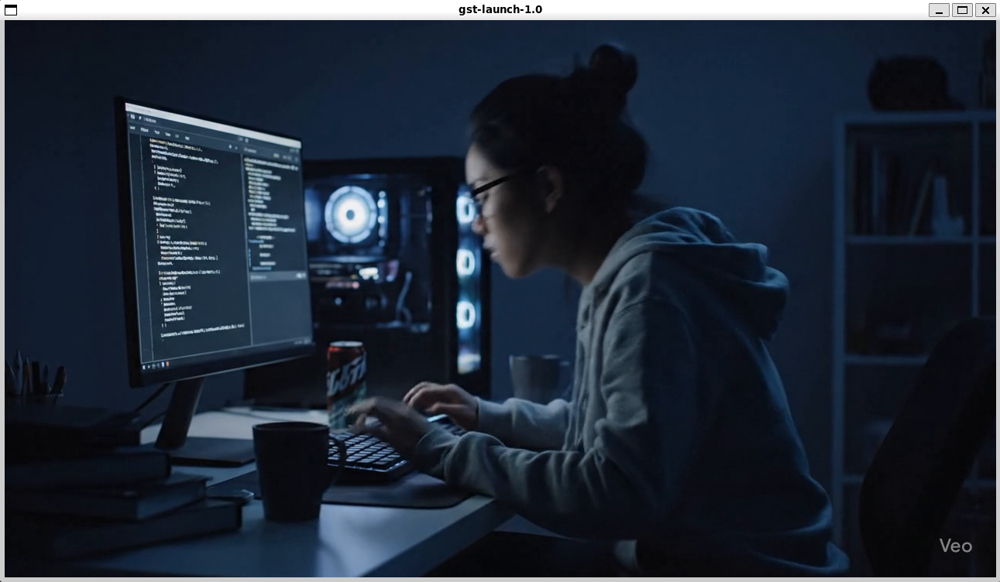
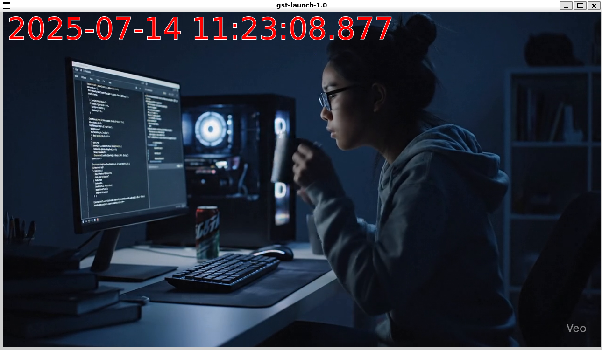

# gst-overlay-timestamp-filter

## 📝 Overview
映像にシステム時刻を重畳するGStreamerのプラグインです。

### 🙂 Before applying filter 


### 😄 After applying filter



## 🔧 Build
以下のコマンドで`build`ディレクトリ配下に共有ライブラリが生成されます。
```bash
mkdir build && cd build && cmake .. && make
```


## 🚀 Running the Sample
付属のサンプルプログラムを使って、動画にタイムスタンプを重畳する機能を試せます。  
サンプルプログラムはDockerを利用する為、ホスト環境を汚すことはありません。

### Build
`docker build`コマンドで、サンプルプログラムを含むDockerイメージをビルドします。
```bash
docker build -t sample-player . --file example/Dockerfile
```

### Run
`docker run`コマンドでコンテナを起動し、動画を再生します。

* 補足: このコマンドは、ローカルのMP4ファイルをコンテナ内で再生し、デスクトップに表示するための設定を含んでいます。`input.mp4`の部分は、お好きな動画ファイル名に置き換えてください。

```bash
docker run -it --rm \
    -e DISPLAY=$DISPLAY \
    -v /tmp/.X11-unix:/tmp/.X11-unix \
    -v $PWD:/video \
    sample-player:latest /video/input.mp4
```